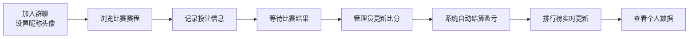

## 1. 产品概述

世界杯期间群内小伙伴体育彩票收支统计与排行榜网站，帮助小圈子记录投注、追踪盈亏、比拼排名，增加看球乐趣。

- 核心目的：记录群内体彩投注数据，自动计算盈亏，生成排行榜，增加世界杯观赛互动性
- 目标用户：一起看球玩体彩的朋友/同事小群体（10-50人）

## 2. 核心功能

### 2.1 用户角色

| 角色 | 加入方式 | 核心权限 |
|------|----------|----------|
| 普通用户 | 昵称加入 | 记录投注、查看自己数据、查看排行榜 |
| 管理员 | 初始创建者 | 管理用户、审核/删除投注记录、管理比赛数据 |

### 2.2 功能模块

1. **排行榜首页**：总盈亏榜、胜率榜、投注次数榜、本周之星
2. **投注记录**：新增投注、投注列表、筛选查询
3. **个人中心**：个人数据统计、历史记录、盈亏走势
4. **比赛赛程**：世界杯比赛列表、比赛结果、比分更新
5. **用户管理**：成员列表、添加/移除成员

### 2.3 页面详情

| 页面名称 | 模块名称 | 功能描述 |
|----------|----------|----------|
| 排行榜首页 | 顶部Banner | 世界杯主题视觉、倒计时、当前赛事进度 |
| 排行榜首页 | 排行榜Tabs | 总盈亏榜、胜率榜、投注次数榜切换 |
| 排行榜首页 | Top3 领奖台 | 前三名特殊展示，带奖杯/奖牌动效 |
| 排行榜首页 | 完整排名列表 | 所有成员排名、盈亏金额、胜率、投注次数 |
| 投注记录页 | 新增投注表单 | 选择比赛、选择投注类型、金额、赔率、预测结果 |
| 投注记录页 | 投注列表 | 按时间倒序展示所有投注，支持筛选（比赛、用户、状态） |
| 投注记录页 | 结算功能 | 比赛结束后更新投注结果，自动计算盈亏 |
| 个人中心页 | 数据概览卡片 | 总盈亏、胜率、投注次数、最大单笔盈利/亏损 |
| 个人中心页 | 盈亏走势图 | 按日期的盈亏曲线图表 |
| 个人中心页 | 历史投注记录 | 该用户所有投注记录列表 |
| 比赛赛程页 | 比赛列表 | 小组赛/淘汰赛分组展示，显示队伍、时间、比分 |
| 比赛赛程页 | 比赛详情 | 对阵双方、开赛时间、投注选项、相关投注记录 |
| 用户管理页 | 成员列表 | 所有成员头像、昵称、加入时间 |
| 用户管理页 | 添加成员 | 输入昵称、选择头像加入群 |

## 3. 核心流程

用户加入后，可以查看排行榜和比赛赛程；记录投注时选择比赛、投注类型、金额和赔率；比赛结束后管理员更新比分，系统自动结算所有相关投注并更新每个人的盈亏数据；排行榜实时更新展示。

## 4. 用户界面设计

### 4.1 设计风格

**整体风格：热血运动风 + 现代深色主题**
- 主色调：深海军蓝 (#0B1E3F) 搭配 世界杯金色 (#D4AF37)
- 辅助色：草皮绿 (#2E7D32)、警示红 (#C62828)、胜负对比色
- 按钮风格：圆角胶囊按钮，金色渐变描边，悬停有发光效果
- 字体：标题使用运动感强的 Bebas Neue，正文使用 Roboto
- 布局：卡片式布局，顶部导航栏，左侧排行榜主视觉
- 图标风格：线性+填充混合，运动主题图标，奖杯/足球元素
- 背景：深色底 + 微妙的足球纹理/网格渐变

### 4.2 页面设计概览

| 页面名称 | 模块名称 | UI 元素 |
|----------|----------|---------|
| 排行榜首页 | 顶部Banner | 大标题、世界杯奖杯图标、赛事进度条、倒计时动效 |
| 排行榜首页 | Top3领奖台 | 阶梯式领奖台布局、奖杯/奖牌图标、金色光晕动效、数字跳动动画 |
| 排行榜首页 | 排名列表 | 斑马纹行、排名数字徽章、盈亏红绿对比色、进度条展示胜率 |
| 投注记录页 | 新增表单 | 卡片式表单、比赛选择下拉、金额输入带筹码图标、赔率计算预览 |
| 投注记录页 | 投注列表 | 时间线布局、比赛对阵展示、状态标签（待结算/赢/输）、盈亏金额高亮 |
| 个人中心页 | 数据概览 | 4宫格数据卡片、图标+数字+趋势箭头、盈亏总览环形图 |
| 个人中心页 | 走势图 | 面积图、红绿渐变填充、悬停显示详情 |
| 比赛赛程页 | 比赛列表 | 分组标签切换、比赛卡片、队徽/队名、时间/比分、投注状态标记 |

### 4.3 响应式

- 桌面端优先设计（1280px+），排行榜左右布局
- 平板端（768-1279px）：排行榜上下布局，缩小间距
- 移动端（<768px）：单列布局，底部Tab导航，卡片堆叠

### 4.4 动效与交互

- 页面加载：排行榜数字从0滚动到目标值，Top3领奖台渐入上升
- 悬停效果：卡片微微上浮+阴影加深，按钮金色光晕扩散
- 排行榜更新：排名变化时数字闪烁+背景色过渡动画
- 新增投注：表单提交成功后投注项从顶部滑入
- 结算动画：盈亏金额数字跳动，绿色/红色闪光反馈
