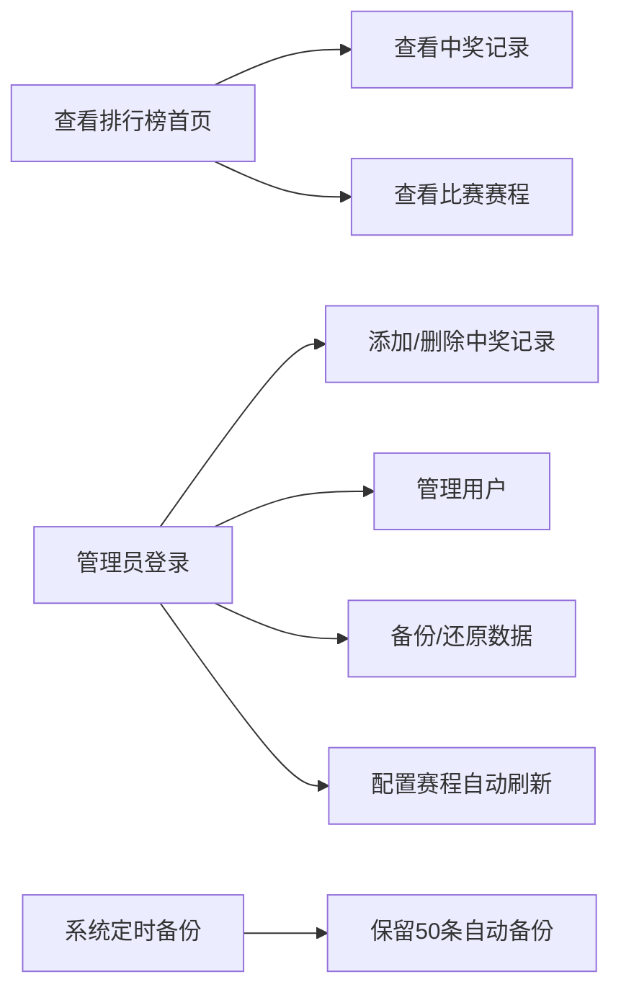

## 1. 产品概述

世界杯期间群内小伙伴体育彩票中奖统计与排行榜网站，帮助小圈子记录中奖、追踪盈亏、比拼排名，增加看球乐趣。

- 核心目的：记录群内体彩中奖数据，自动计算盈亏，生成排行榜，增加世界杯观赛互动性
- 目标用户：一起看球玩体彩的朋友/同事小群体（10-50人）
- 部署方式：私有服务器部署，数据独立存储

## 2. 核心功能

### 2.1 用户角色

| 角色 | 加入方式 | 核心权限 |
|------|----------|----------|
| 普通用户 | 昵称加入 | 查看排行榜、查看中奖记录、查看赛程 |
| 管理员 | 密码登录 | 管理用户、增删中奖记录、管理赛程、备份还原、修改密码 |

### 2.2 功能模块

1. **排行榜首页**：总盈亏榜、胜率榜、投注次数榜、Top3 领奖台
2. **中奖记录**：新增中奖记录、记录列表、按用户筛选
3. **比赛赛程**：世界杯比赛列表、比分自动刷新、按北京时间显示
4. **用户管理**：成员列表、添加/移除成员、自定义头像
5. **系统设置**：管理员登录、修改密码、环境切换、备份还原

### 2.3 页面详情

| 页面名称 | 模块名称 | 功能描述 |
|----------|----------|----------|
| 排行榜首页 | 顶部标题 | 世界杯主题、统计数据概览（总人数、总投注、总盈亏） |
| 排行榜首页 | 排行榜Tabs | 总盈亏榜、胜率榜、投注次数榜切换 |
| 排行榜首页 | Top3 领奖台 | 前三名特殊展示，金色/银色/铜色区分 |
| 排行榜首页 | 完整排名列表 | 所有成员排名、盈亏金额、胜率、投注次数 |
| 排行榜首页 | 下拉刷新 | 下拉刷新数据，兼容微信内浏览器 |
| 中奖记录页 | 新增记录表单 | 选择用户、输入金额、备注、上传图片 |
| 中奖记录页 | 记录列表 | 按时间倒序展示所有中奖记录，支持按用户筛选 |
| 中奖记录页 | 图片查看 | 点击图片放大查看，支持缩放 |
| 比赛赛程页 | 比赛列表 | 按日期分组展示，显示队伍国旗、时间、比分 |
| 比赛赛程页 | 自动刷新 | 默认1分钟自动刷新比分，可自定义间隔 |
| 用户管理页 | 成员列表 | 所有成员头像、昵称、加入时间 |
| 用户管理页 | 添加成员 | 输入昵称、选择头像加入 |
| 设置面板 | 管理员登录 | 密码验证登录 |
| 设置面板 | 修改密码 | 修改管理员密码 |
| 设置面板 | 环境切换 | production / test 双环境切换 |
| 设置面板 | 备份管理 | 手动备份、还原、下载备份文件 |

## 3. 核心流程

用户加入后，可以查看排行榜和比赛赛程；管理员登录后可以添加中奖记录、管理用户、管理赛程数据；系统自动定时备份数据防止丢失。

## 4. 用户界面设计

### 4.1 设计风格

**整体风格：2026 世界杯风格 + 现代深浅双主题**
- 主色调：海军蓝 (#3F51B5) 搭配 世界杯金色 (#D4AF37)
- 辅助色：金色渐变按钮、红涨绿跌（中国股市风格）
- 按钮风格：btn-gold 深金渐变主按钮 / btn-outline 金边透明底次按钮
- 布局：卡片式布局，顶部导航栏，移动端底部导航
- 图标风格：Lucide React 线性图标
- 背景：支持浅色/深色双主题切换，主题保存在浏览器本地

### 4.2 页面设计概览

| 页面名称 | 模块名称 | UI 元素 |
|----------|----------|---------|
| 排行榜首页 | 顶部统计 | 总人数、总投注、总盈亏 数据展示 |
| 排行榜首页 | Top3领奖台 | 阶梯式领奖台、金/银/铜数字颜色、头像展示 |
| 排行榜首页 | 排名列表 | 排名数字徽章、盈亏金额红绿对比色、胜率进度条 |
| 中奖记录页 | 新增表单 | 选择用户（头像+昵称网格选择）、金额输入、图片上传 |
| 中奖记录页 | 记录列表 | 卡片式展示、用户头像、金额高亮、图片缩略图 |
| 比赛赛程页 | 比赛列表 | 按日期分组、球队国旗、比分、比赛状态标签 |
| 比赛赛程页 | 刷新状态 | 自动刷新提示、上次刷新时间 |

### 4.3 响应式

- 桌面端（768px+）：顶部导航栏，左右布局
- 移动端（<768px）：单列布局，底部 Tab 导航，卡片堆叠
- 响应式字号：标题（mobile:text-4xl / sm:text-5xl / md:text-6xl）

### 4.4 动效与交互

- 下拉刷新：拖拽释放回弹，刷新完成提示
- 页面切换：Framer Motion 平滑过渡
- 排行榜更新：数字变化动画
- 新增记录：表单提交成功后顶部滑入

## 5. 数据与存储

- **数据分离**：用户数据（data.json）与赛程数据（matches.json）分开存储
- **备份范围**：仅备份用户数据，不备份赛程数据
- **环境隔离**：production / test 双环境，数据独立存放
- **图片存储**：用户头像和中奖图片独立存放于 uploads 目录
- **自动备份**：启动 5 分钟后首次备份，之后每 15 分钟一次，保留 50 条自动备份
