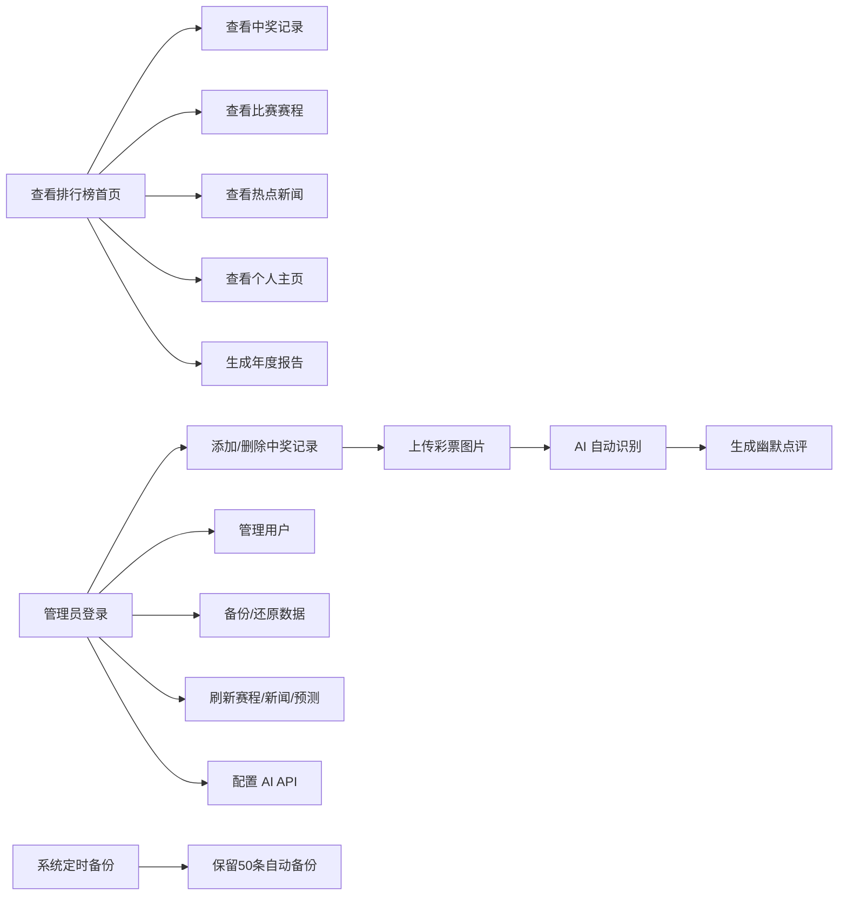

## 1. 产品概述

2026 世界杯期间群内小伙伴体育彩票中奖统计与排行榜网站，帮助小圈子记录中奖、追踪盈亏、比拼排名，增加看球乐趣。

- 核心目的：记录群内体彩中奖数据，自动计算盈亏，生成排行榜，AI 识别彩票，生成年终报告
- 目标用户：一起看球玩体彩的朋友/同事小群体（10-50人）
- 部署方式：私有服务器部署，数据独立存储

## 2. 核心功能

### 2.1 用户角色

| 角色 | 加入方式 | 核心权限 |
|------|----------|----------|
| 普通用户 | 昵称加入 | 查看排行榜、查看中奖记录、查看赛程、查看新闻、查看个人主页、生成年度报告 |
| 管理员 | 密码登录 | 管理用户、增删中奖记录、刷新赛程/新闻/预测、备份还原、AI 配置、修改密码 |

### 2.2 功能模块

1. **排行榜首页**：总盈亏榜、胜率榜、投注次数榜、Top3 领奖台、成就徽章
2. **中奖记录**：新增中奖记录、记录列表、按用户筛选、AI 图片识别、AI 幽默点评
3. **比赛赛程**：世界杯比赛列表、比分自适应刷新、淘汰赛对阵图、按北京时间显示
4. **热点新闻**：自动抓取世界杯相关热点新闻
5. **奖金计算器**：内置奖金计算工具（嵌入第三方页面）
6. **个人主页**：用户个人投注数据、趋势图表、成就徽章展示
7. **世界杯年度报告**：14 页精美滑动报告，包含财富曲线、最擅长玩法、最有缘球队、群友对决等
8. **用户管理**：成员列表弹窗、添加/编辑/移除成员、自定义头像（emoji/图片）
9. **系统设置**：管理员登录、修改密码弹窗、备份还原、AI 配置

### 2.3 页面详情

| 页面名称 | 模块名称 | 功能描述 |
|----------|----------|----------|
| 排行榜首页 | 顶部标题 | 世界杯主题、统计数据概览（总人数、总投注、总盈亏） |
| 排行榜首页 | 排行榜Tabs | 总盈亏榜、胜率榜、投注次数榜切换 |
| 排行榜首页 | Top3 领奖台 | 前三名特殊展示，金色/银色/铜色区分 |
| 排行榜首页 | 完整排名列表 | 所有成员排名、盈亏金额、胜率、投注次数、最高徽章 |
| 排行榜首页 | 下拉刷新 | 下拉刷新数据，兼容微信内浏览器 |
| 中奖记录页 | 新增记录表单 | 选择用户、输入金额、备注、上传图片 |
| 中奖记录页 | 记录列表 | 按时间倒序展示所有中奖记录，支持按用户筛选 |
| 中奖记录页 | AI 识别 | 上传彩票图片后自动 AI 识别对阵/玩法/比分/中奖结果 |
| 中奖记录页 | AI 点评 | 识别后生成风趣幽默的点评文案 |
| 中奖记录页 | 重新识别 | 管理员可对识别失败的记录手动触发重新识别 |
| 中奖记录页 | 图片查看 | 点击图片放大查看，支持缩放 |
| 比赛赛程页 | 比赛列表 | 按日期分组展示，显示队伍国旗、时间、比分 |
| 比赛赛程页 | 淘汰赛对阵图 | 可视化展示淘汰赛对阵关系和晋级路径 |
| 比赛赛程页 | 自适应刷新 | 有 live 比赛 1 分钟、即将开赛 5 分钟、无比赛 2 小时 |
| 热点新闻页 | 新闻列表 | 自动抓取世界杯热点新闻，管理员可手动刷新 |
| 奖金计算器页 | 计算工具 | 嵌入第三方奖金计算页面，移动端适配 |
| 个人主页 | 数据概览 | 个人投注统计、中奖金额、胜率 |
| 个人主页 | 趋势图表 | 投注趋势可视化 |
| 个人主页 | 成就徽章 | 已获得的成就徽章展示 |
| 年度报告 | 14 页报告 | 封面→第一笔中奖→概览→财富曲线→时间规律→最佳单日→最大中奖→AI评价→最擅长玩法→最有缘球队→连胜→群友对决→CP徽章→结尾 |
| 用户管理弹窗 | 成员列表 | 所有成员头像、昵称、投注统计 |
| 用户管理弹窗 | 添加/编辑成员 | 输入昵称、选择 emoji 头像或上传图片 |
| 设置面板 | 管理员登录 | 密码验证登录 |
| 设置面板 | 密码修改弹窗 | 弹窗形式修改管理员密码 |
| 设置面板 | 备份管理 | 手动备份、还原、下载备份文件 |
| 设置面板 | AI 配置 | 配置 API 地址、密钥、模型、官网地址 |

## 3. 核心流程

用户加入后，可以查看排行榜和比赛赛程；管理员登录后可以添加中奖记录、管理用户、刷新数据；上传彩票图片后自动 AI 识别并生成点评；系统自动定时备份数据防止丢失。

## 4. 用户界面设计

### 4.1 设计风格

**整体风格：2026 世界杯风格 + 现代深浅双主题**
- 主色调：海军蓝 (#3F51B5) 搭配 世界杯金色 (#D4AF37)
- 辅助色：金色渐变按钮、红涨绿跌（中国股市风格）
- 按钮风格：btn-gold 深金渐变主按钮 / btn-outline 金边透明底次按钮
- 布局：卡片式布局，顶部导航栏，移动端底部导航
- 图标风格：Lucide React 线性图标
- 背景：支持浅色/深色双主题切换，主题保存在浏览器本地

### 4.2 模态框统一视觉规范

所有模态框遵循统一视觉规范：
- 宽度：max-w-lg / max-w-sm
- 圆角：rounded-2xl
- 覆盖层：bg-black/50 backdrop-blur-sm
- 头部：p-5，带 w-9 h-9 rounded-xl 图标，text-lg font-semibold 标题
- 关闭按钮：w-8 h-8 rounded-lg
- 内容区：p-5，space-y-4
- 输入框：px-3 py-2.5 rounded-xl
- 按钮：py-2.5 rounded-xl
- 边框：border-neutral-100 / dark:border-neutral-800
- 动画：[0.34, 1.56, 0.64, 1] 缓动
- 高度：max-h-[85vh]

### 4.3 Header 设计

Header 元素顺序：主题切换 → 设置按钮 → 环境状态 → 管理员状态
- 间距：gap-2
- 环境状态：测试环境橙色背景+"测试"，正式环境绿色背景+"正式"
- 管理员状态：仅显示"管理员"三字，无图标
- 刷新按钮：仅管理员可见

### 4.4 响应式

- 桌面端（768px+）：顶部导航栏，左右布局
- 移动端（<768px）：单列布局，底部 Tab 导航，卡片堆叠
- 响应式字号：标题（mobile:text-4xl / sm:text-5xl / md:text-6xl）

### 4.5 动效与交互

- 下拉刷新：拖拽释放回弹，刷新完成提示
- 页面切换：Framer Motion 平滑过渡
- 排行榜更新：数字变化动画
- 新增记录：表单提交成功后顶部滑入
- 年度报告：全屏滑动翻页，每页独立动画

## 5. 数据与存储

- **单一数据源**：使用 data.json 存储用户数据，不再使用多环境隔离
- **数据分离**：用户数据（data.json）与赛程数据（matches.json）分开存储
- **AI 配置**：存储在 ai-config.json，服务端管理
- **备份范围**：仅备份用户数据，不备份赛程数据和 AI 配置
- **图片存储**：用户头像和中奖图片独立存放于 uploads 目录
- **自动备份**：启动 5 分钟后首次备份，之后每 15 分钟一次，保留 50 条自动备份
- **主题存储**：主题保存在浏览器本地 localStorage

## 6. AI 智能功能

### 6.1 AI 彩票识别

- 上传彩票图片后，自动调用 AI 多模态 API 识别
- 识别内容包括：对阵双方、玩法类型、投注选项、赔率、比分、中奖结果
- 识别后生成风趣幽默的点评文案（150 字以内）
- 支持 4 类玩法：胜平负（含让球）、比分、总进球数、半全场
- 所有玩法按 90 分钟常规时间比分结算
- 60 秒超时保护，失败自动清理状态
- 管理员可手动触发"重新识别"

### 6.2 AI 比赛预测

- 每日自动预测次日比赛（按北京时间）
- 结合赛程数据、近期战绩、热点新闻生成预测
- 预测结果永久记录（不再限制 30 天）
- 管理员可手动触发刷新

### 6.3 AI 配置

- 配置存储在服务端 ai-config.json
- 包含：API 地址、API 密钥、模型名称（默认 gpt-4o-mini）、官网地址
- 管理员通过设置面板配置
- API 密钥不暴露给前端

## 7. 玩法类型

| 玩法 | 说明 | 结算规则 |
|------|------|----------|
| ⚖️ 胜平负 | 包含普通胜平负和让球胜平负 | 90 分钟常规时间 |
| 🔢 比分 | 预测具体比分，支持复式投注 | 90 分钟常规时间 |
| ⚽ 总进球数 | 预测总进球数，支持多选 | 90 分钟常规时间 |
| ⏱️ 半全场 | 半场+全场结果组合 | 90 分钟常规时间 |

> 所有玩法均按 90 分钟常规时间（含伤停补时）的比分结算，加时赛和点球大战不算。

## 8. 年度报告

14 页滑动报告，页面顺序：

| 序号 | 页面 | 说明 |
|------|------|------|
| 1 | 封面 | 开场仪式感 |
| 2 | 第一笔中奖 | 故事起点 |
| 3 | 概览统计 | 整体数据认知 |
| 4 | 财富曲线 | 资金变化过程 |
| 5 | 时间规律 | 运气时段分析 |
| 6 | 最佳单日 | 最辉煌的一天 |
| 7 | 最大中奖 | 最高光时刻 |
| 8 | AI 评价 | 紧跟最大中奖，即时点评 |
| 9 | 最擅长玩法 | 技术分析 |
| 10 | 最有缘球队 | 缘分分析 |
| 11 | 连胜记录 | 持续性分析 |
| 12 | 群友对决 | 社交对比（TOP3/群内数据/胜负关系） |
| 13 | CP 徽章 | 彩蛋惊喜 |
| 14 | 结尾 | 总结展望 |
