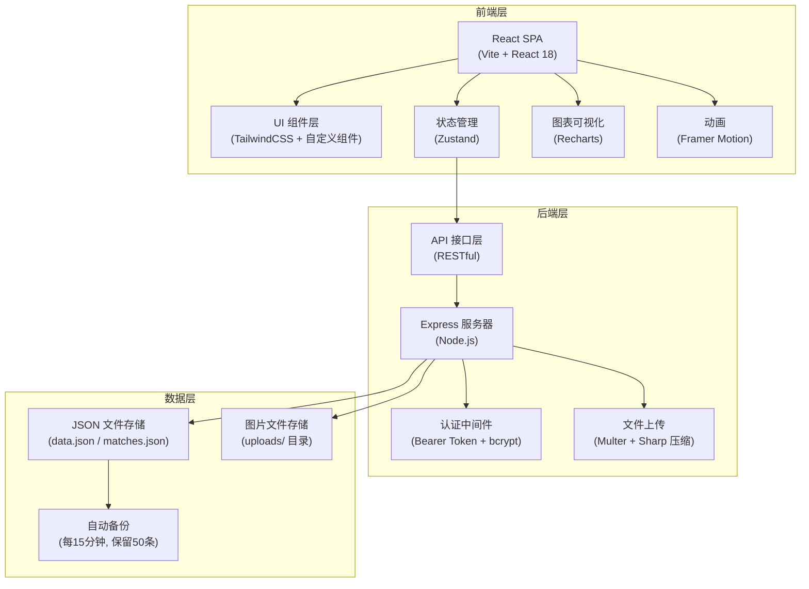
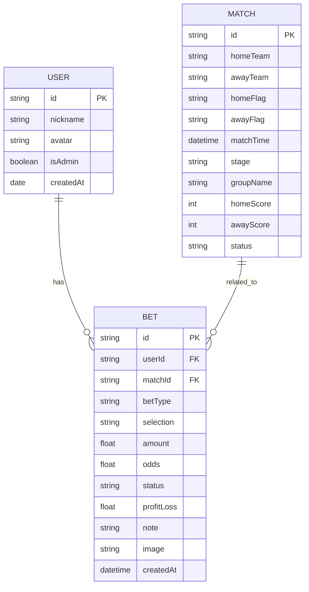

## 1. 架构设计

本项目为前后端分离的 Web 应用，前端使用 React + TypeScript，后端使用 Node.js + Express，数据存储为 JSON 文件，适合小圈子私有部署使用。



## 2. 技术描述

- **前端框架**：React@18 + TypeScript
- **构建工具**：Vite@5
- **样式方案**：TailwindCSS@3 + CSS 变量主题系统（深浅双主题）
- **状态管理**：Zustand（轻量级，支持中间件和持久化）
- **图表库**：Recharts
- **路由**：React Router@6
- **图标**：Lucide React
- **动画**：Framer Motion
- **后端框架**：Express.js
- **认证**：Bearer Token + bcrypt 密码加密
- **文件上传**：Multer + Sharp 图片压缩
- **数据存储**：JSON 文件（data.json 存用户数据，matches.json 存赛程数据）
- **容器化**：Docker + Unraid 部署

## 3. 路由定义

| 路由 | 页面组件 | 用途 |
|------|----------|------|
| `/` | `RankingPage` | 排行榜首页，总盈亏/胜率/投注次数榜 |
| `/bets` | `BetsPage` | 中奖记录页，新增+列表+筛选 |
| `/matches` | `MatchesPage` | 比赛赛程页，赛程列表+自动刷新 |
| `/users` | `UsersPage` | 用户管理页，成员列表+添加成员 |

## 4. 数据模型

### 4.1 数据模型定义



### 4.2 数据结构（TypeScript 类型）

```typescript
// 用户
interface User {
  id: string;
  nickname: string;
  avatar: string;
  isAdmin: boolean;
  createdAt: string;
}

// 比赛
interface Match {
  id: string;
  homeTeam: string;
  awayTeam: string;
  homeFlag: string;
  awayFlag: string;
  matchTime: string;
  stage: 'group' | 'knockout';
  groupName?: string;
  homeScore: number | null;
  awayScore: number | null;
  status: 'upcoming' | 'live' | 'finished';
}

// 中奖记录
interface Bet {
  id: string;
  userId: string;
  matchId?: string;
  betType: '1x2' | 'over_under' | 'handicap';
  selection: string;
  amount: number;
  odds: number;
  status: '中奖';
  profitLoss: number;
  note?: string;
  image?: string;
  createdAt: string;
  date: string;
}

// 排行榜数据（计算得出）
interface RankingItem {
  userId: string;
  nickname: string;
  avatar: string;
  totalProfitLoss: number;
  winRate: number;
  totalBets: number;
  wonBets: number;
}
```

## 5. 数据存储设计

### 5.1 文件结构

```
/app/data/
├── auth.json              # 管理员密码 (bcrypt)
├── production/            # 生产环境
│   ├── data.json          # 用户数据 + 投注记录
│   ├── matches.json       # 赛程数据
│   └── backups/           # 备份目录
│       ├── backup_*.json  # 备份文件
│       └── ...
└── test/                  # 测试环境
    ├── data.json
    ├── matches.json
    └── backups/

/app/uploads/
├── avatars/               # 用户头像图片
└── bets/                  # 中奖记录图片
```

### 5.2 data.json 结构

```json
{
  "version": 1,
  "users": [],
  "bets": [],
  "apiKey": "",
  "competition": "WC",
  "currentUserId": "user1",
  "refreshInterval": 60
}
```

### 5.3 matches.json 结构

```json
{
  "matches": []
}
```

## 6. 状态管理设计（Zustand）

### 6.1 Store 结构

```typescript
interface AppState {
  // 数据
  users: User[];
  bets: Bet[];
  matches: Match[];
  currentUserId: string | null;
  environment: 'production' | 'test';

  // 主题
  theme: 'light' | 'dark';

  // 认证
  isAdminLoggedIn: boolean;
  adminToken: string | null;

  // API 配置
  apiConfig: ApiConfig;

  // UI 状态
  isLoading: boolean;
  isDataLoaded: boolean;
  isRefreshing: boolean;

  // 操作
  loadData: () => Promise<void>;
  addUser: (user: User) => Promise<void>;
  removeUser: (id: string) => Promise<void>;
  addBet: (bet: Bet) => Promise<void>;
  removeBet: (id: string) => Promise<void>;
  switchEnvironment: (env: string) => Promise<void>;
  adminLogin: (password: string) => Promise<boolean>;
  adminLogout: () => void;
  toggleTheme: () => void;
}
```

### 6.2 核心业务逻辑

1. **盈亏计算引擎**：根据投注类型和比赛结果计算盈亏
2. **排行榜计算**：按用户聚合计算总盈亏、胜率等指标
3. **数据同步**：状态变化时自动保存到服务器
4. **数据加载保护**：防止初始化竞态条件导致数据覆盖

## 7. 模块划分

```
src/
├── components/          # 通用组件
│   ├── Layout/          # 布局组件（Header, MobileNav）
│   ├── RankingPodium/   # Top3 领奖台
│   ├── RankingList/     # 排名列表
│   ├── BetForm/         # 投注表单
│   ├── BetList/         # 投注列表
│   ├── BackupModal/     # 备份管理
│   ├── SettingsModal/   # 设置面板
│   ├── ApiSettingsModal/ # API 设置
│   ├── Avatar.tsx       # 头像组件（懒加载）
│   └── ...
├── pages/               # 页面组件
│   ├── RankingPage.tsx
│   ├── BetsPage.tsx
│   ├── MatchesPage.tsx
│   └── UsersPage.tsx
├── store/               # 状态管理 (Zustand)
│   └── useAppStore.ts
├── services/            # 服务层
│   └── footballApi.ts   # 足球 API 服务
├── utils/               # 工具函数
│   ├── api.ts           # API 请求封装
│   ├── helpers.ts       # 格式化工具函数
│   ├── calculations.ts  # 盈亏计算、排行榜计算
│   ├── apiConfig.ts     # API 配置管理
│   ├── theme.ts         # 主题管理
│   └── mockData.ts      # 初始 mock 数据
├── types/               # TypeScript 类型定义
│   └── index.ts
└── App.tsx
```

## 8. 关键技术点

1. **数据分离**：用户数据（data.json）与赛程数据（matches.json）分开存储，备份仅备份用户数据
2. **双环境隔离**：production / test 双环境，数据独立存放，可在设置中切换
3. **自动备份机制**：启动 5 分钟后首次备份，之后每 15 分钟一次，保留 50 条自动备份
4. **手动备份保护**：手动备份标注为 manual，不参与自动清理
5. **图片懒加载**：头像使用 IntersectionObserver + native loading="lazy" 双重懒加载
6. **图片自动压缩**：上传图片自动压缩（最大宽度 1280px，质量 80%）
7. **微信内浏览器兼容**：overscroll-behavior: none + passive:false 事件绑定实现下拉刷新
8. **Bearer Token 认证**：所有写入操作需认证，Token 有效期 24 小时
9. **bcrypt 密码加密**：管理员密码使用 bcrypt 加密存储
10. **红涨绿跌配色**：符合中国股市习惯的颜色方案
11. **北京时间显示**：所有比赛时间按北京时间（Asia/Shanghai）格式化显示
12. **初始化竞态保护**：防止页面刷新时异步加载数据未完成前旧数据覆盖新数据
