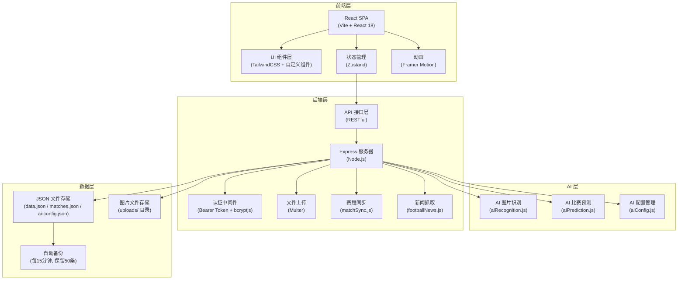
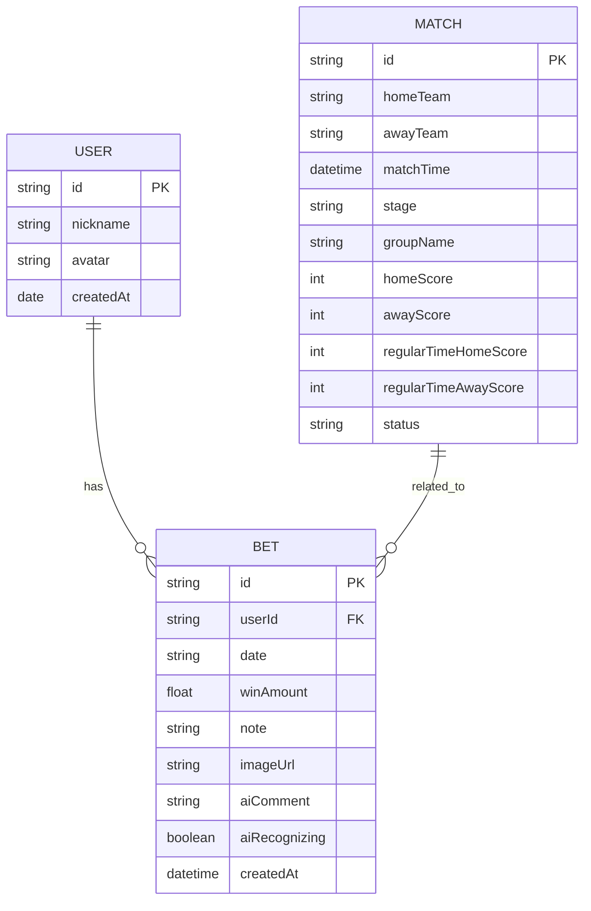

## 1. 架构设计

本项目为前后端分离的 Web 应用，前端使用 React + TypeScript，后端使用 Node.js + Express，数据存储为 JSON 文件，适合小圈子私有部署使用。



## 2. 技术栈

### 前端
- **框架**：React@18 + TypeScript
- **构建工具**：Vite
- **样式方案**：TailwindCSS + CSS 变量主题系统（深浅双主题）
- **状态管理**：Zustand（轻量级，支持中间件和持久化）
- **路由**：React Router@6（懒加载）
- **图标**：Lucide React
- **动画**：Framer Motion

### 后端
- **框架**：Express.js
- **认证**：Bearer Token + bcryptjs 密码加密
- **文件上传**：Multer
- **数据存储**：JSON 文件（data.json / matches.json / ai-config.json）
- **容器化**：Docker + Unraid 部署

### AI 能力
- **图片识别**：OpenAI 兼容多模态 API（GPT-4o、DeepSeek-VL 等）
- **文本生成**：幽默风趣的彩票点评文案
- **比赛预测**：结合赛程/战绩/新闻的综合预测
- **超时保护**：60 秒 AbortController 超时

## 3. 路由定义

| 路由 | 页面组件 | 加载方式 | 用途 |
|------|----------|----------|------|
| `/` | `RankingPage` | 直接加载 | 排行榜首页 |
| `/bets` | `BetsPage` | 懒加载 | 中奖记录页 |
| `/matches` | `MatchesPage` | 懒加载 | 比赛赛程页 |
| `/news` | `NewsPage` | 懒加载 | 热点新闻页 |
| `/calculator` | `CalculatorPage` | 懒加载 | 奖金计算器页 |
| `/profile/:userId` | `ProfilePage` | 懒加载 | 个人主页 |
| `/report/:userId` | `ReportPage` | 懒加载 | 世界杯年度报告 |

## 4. 数据模型

### 4.1 实体关系



### 4.2 数据结构（TypeScript 类型）

```typescript
// 用户
interface User {
  id: string;
  nickname: string;
  avatar: string;
  createdAt: string;
}

// 比赛
interface Match {
  id: string;
  homeTeam: string;
  awayTeam: string;
  matchTime: string;
  stage: 'group' | 'knockout';
  groupName?: string;
  homeScore: number | null;
  awayScore: number | null;
  regularTimeHomeScore: number | null;
  regularTimeAwayScore: number | null;
  homePenaltyScore?: number | null;
  awayPenaltyScore?: number | null;
  status: 'upcoming' | 'live' | 'finished';
  matchNumber?: number;
}

// 中奖记录
interface Bet {
  id: string;
  userId: string;
  date: string;
  winAmount: number;
  note?: string;
  imageUrl?: string;
  aiComment?: string;
  aiRecognizing?: boolean;
  createdAt: string;
}

// 排行榜数据（计算得出）
interface RankingItem {
  userId: string;
  nickname: string;
  avatar: string;
  totalWinAmount: number;
  totalBets: number;
  winDays: number;
  winRate: number;
  maxStreak: number;
  biggestWin: number;
  topBadges: UserBadge[];
  bestCP?: { userId: string; nickname: string; avatar: string; commonWinDays: number; };
}
```

## 5. 数据存储设计

### 5.1 文件结构

```
/app/data/
├── auth.json              # 管理员密码 (bcryptjs)
├── data.json              # 用户数据 + 投注记录
├── matches.json           # 赛程数据
├── ai-config.json         # AI API 配置
└── backups/               # 备份目录
    ├── auto_backup_*.json # 自动备份
    └── manual_backup_*.json # 手动备份（不参与自动清理）

/app/uploads/
├── avatars/               # 用户头像图片
└── bets/                  # 中奖记录图片
```

### 5.2 data.json 结构

```json
{
  "users": [],
  "bets": [],
  "currentUserId": "user1"
}
```

### 5.3 matches.json 结构

```json
{
  "matches": []
}
```

### 5.4 ai-config.json 结构

```json
{
  "apiEndpoint": "https://api.openai.com/v1/chat/completions",
  "apiKey": "",
  "model": "gpt-4o-mini",
  "siteUrl": ""
}
```

## 6. 状态管理设计（Zustand）

### 6.1 Store 结构

```typescript
interface AppState {
  // 数据
  users: User[];
  bets: Bet[];
  matches: Match[];
  currentUserId: string | null;
  environment: Environment;

  // 主题
  theme: ThemeMode;
  designVersion: DesignVersion;

  // 认证
  isAdminLoggedIn: boolean;

  // API 配置
  apiConfig: ApiConfig;

  // UI 状态
  isLoading: boolean;
  isDataLoaded: boolean;
  isRefreshing: boolean;
  showSettingsModal: boolean;

  // 操作
  init: () => Promise<void>;
  addUser: (nickname: string, avatar: string) => void;
  removeUser: (userId: string) => void;
  addBet: (bet: Bet) => void;
  removeBet: (betId: string) => void;
  adminLogin: (password: string) => Promise<boolean>;
  adminLogout: () => void;
}
```

### 6.2 核心业务逻辑

1. **排行榜计算**：按用户聚合计算总盈亏、胜率、中奖天数等指标
2. **AI 识别流程**：上传图片 → 服务端调用 AI API → 解析结果 → 生成点评
3. **赛程自适应同步**：有 live 比赛 1 分钟、即将开赛 5 分钟、无比赛 2 小时
4. **数据同步**：状态变化时自动保存到服务器
5. **数据加载保护**：防止初始化竞态条件导致数据覆盖

## 7. 模块划分

### 7.1 前端结构

```
src/
├── components/               # 通用组件
│   ├── Layout/               # 布局组件（Header, MobileNav）
│   ├── SettingsModal/        # 设置面板
│   ├── BackupModal/          # 备份管理
│   ├── PasswordModal/        # 密码修改弹窗
│   ├── AIConfigModal/        # AI 配置弹窗
│   ├── ApiSettingsModal/     # API 设置
│   ├── UsersModal/           # 用户管理弹窗
│   ├── EditUserModal/        # 编辑用户弹窗
│   ├── RankingPodium/        # Top3 领奖台
│   ├── RankingList/          # 排名列表
│   ├── BetForm/              # 投注表单
│   ├── BetList/              # 投注列表
│   ├── MatchCard/            # 比赛卡片
│   ├── KnockoutBracket/      # 淘汰赛对阵图
│   ├── TrendChart/           # 趋势图表
│   ├── Charts/               # 图表组件
│   ├── AvatarPicker/         # 头像选择器
│   ├── BadgeDisplay/         # 徽章展示
│   ├── ThemeToggle/          # 主题切换
│   ├── DesignVersionToggle/  # 设计版本切换
│   ├── ImageUploader/        # 图片上传
│   ├── ImageViewer/          # 图片查看
│   └── Avatar.tsx            # 头像组件（懒加载）
├── pages/                    # 页面组件
│   ├── RankingPage.tsx       # 排行榜首页
│   ├── BetsPage.tsx          # 中奖记录页
│   ├── MatchesPage.tsx       # 比赛赛程页
│   ├── NewsPage.tsx          # 热点新闻页
│   ├── CalculatorPage.tsx    # 奖金计算器页
│   ├── ProfilePage.tsx       # 个人主页
│   └── ReportPage.tsx        # 世界杯年度报告
├── store/                    # 状态管理 (Zustand)
│   └── useAppStore.ts
├── utils/                    # 工具函数
│   ├── api.ts                # API 请求封装
│   ├── helpers.ts            # 通用工具函数
│   ├── calculations.ts       # 盈亏/排名计算
│   ├── aiParser.ts           # AI 结果解析
│   ├── reportData.ts         # 报告数据生成
│   ├── badges.ts             # 徽章逻辑
│   ├── theme.ts              # 主题管理
│   ├── apiConfig.ts          # API 配置存储
│   └── imageCompress.ts      # 图片压缩
├── services/                 # 服务层
│   └── footballApi.ts        # 足球 API 服务
├── types/                    # TypeScript 类型定义
│   └── index.ts
└── App.tsx
```

### 7.2 后端结构

```
server/
├── server.js                 # Express 服务器主入口
├── matchSync.js              # 赛程同步（自适应刷新）
├── aiRecognition.js          # AI 图片识别
├── aiPrediction.js           # AI 比赛预测
├── aiConfig.js               # AI 配置管理
├── footballNews.js           # 足球新闻抓取
└── package.json
```

## 8. 关键技术点

1. **单一数据源**：使用 data.json 存储用户数据，删除多环境隔离功能
2. **数据分离**：用户数据（data.json）与赛程数据（matches.json）分开存储，备份仅备份用户数据
3. **AI 图片识别**：服务端调用 OpenAI 兼容多模态 API，前端直接传图片 URL，不做 base64 转换
4. **AI 配置安全**：API 密钥存储在服务端 ai-config.json，不暴露给前端
5. **自适应赛程同步**：有 live 比赛 1 分钟、即将开赛 5 分钟、无比赛 2 小时
6. **常规时间比分**：体彩竞彩按 90 分钟常规时间结算，使用 regularTimeHomeScore/regularTimeAwayScore 字段
7. **淘汰赛对阵图**：按 stage 字段判断轮次（LAST_32→round_of_32 等），按对阵顺序排序
8. **自动备份机制**：启动 5 分钟后首次备份，之后每 15 分钟一次，保留 50 条自动备份
9. **手动备份保护**：手动备份标注为 manual，不参与自动清理
10. **图片懒加载**：头像使用 IntersectionObserver + native loading="lazy" 双重懒加载
11. **微信内浏览器兼容**：overscroll-behavior: none + passive:false 事件绑定实现下拉刷新
12. **Bearer Token 认证**：所有写入操作需认证，Token 有效期 24 小时
13. **bcryptjs 密码加密**：管理员密码使用 bcryptjs 加密存储
14. **红涨绿跌配色**：符合中国股市习惯的颜色方案
15. **北京时间显示**：所有比赛时间按北京时间（Asia/Shanghai）格式化显示
16. **AI 超时保护**：60 秒 AbortController 超时，失败自动清理 aiRecognizing 状态
17. **手动重新识别**：管理员可对识别失败的记录手动触发"重新识别"
18. **统一模态框规范**：所有弹窗遵循统一的视觉规范（宽度/圆角/动画/布局）
19. **年度报告**：14 页全屏滑动报告，每页独立动画，按叙事逻辑排序
20. **路由懒加载**：除首页外所有页面使用 React.lazy 懒加载，优化首屏性能
