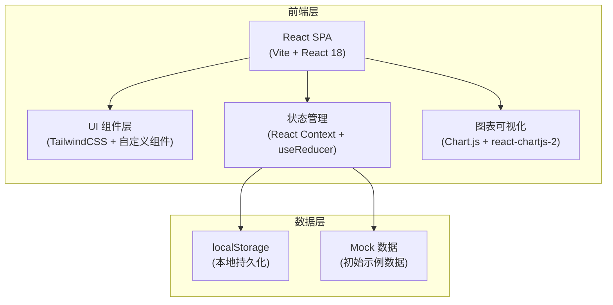
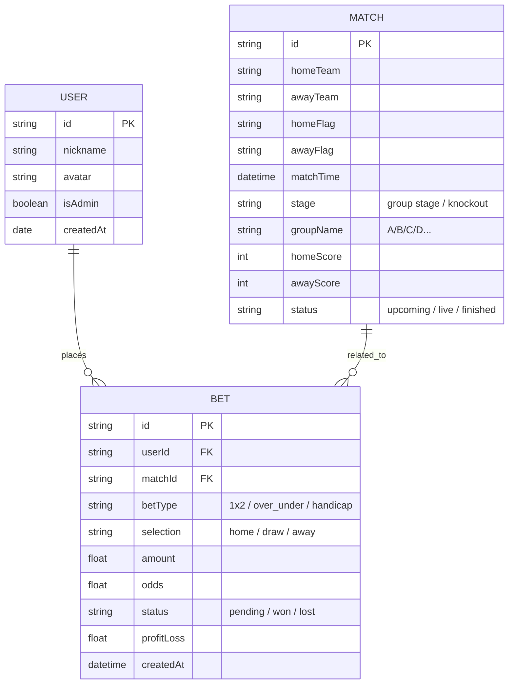

## 1. 架构设计

本项目为前端单页应用，数据存储在浏览器 localStorage 中，适合小圈子本地使用。如需多端同步可后续扩展后端服务。



## 2. 技术描述

- **前端框架**：React@18 + TypeScript
- **构建工具**：Vite@5
- **样式方案**：TailwindCSS@3 + CSS 变量主题系统
- **状态管理**：React Context + useReducer（轻量级，适合中小型应用）
- **图表库**：Chart.js + react-chartjs-2（盈亏走势图、环形图）
- **路由**：React Router@6
- **数据持久化**：localStorage（JSON 序列化）
- **图标**：Lucide React
- **动画**：Framer Motion（可选，复杂动效时使用）/ CSS Transitions

## 3. 路由定义

| 路由 | 页面组件 | 用途 |
|------|----------|------|
| `/` | `RankingPage` | 排行榜首页，总盈亏/胜率/投注次数榜 |
| `/bets` | `BetsPage` | 投注记录页，新增+列表+筛选 |
| `/profile/:userId` | `ProfilePage` | 个人中心，数据统计+走势图 |
| `/matches` | `MatchesPage` | 比赛赛程页，比赛列表+比分更新 |
| `/users` | `UsersPage` | 用户管理页，成员列表+添加成员 |

## 4. 数据模型

### 4.1 数据模型定义



### 4.2 数据结构（TypeScript 类型）

```typescript
// 用户
interface User {
  id: string;
  nickname: string;
  avatar: string;
  isAdmin: boolean;
  createdAt: string;
}

// 比赛
interface Match {
  id: string;
  homeTeam: string;
  awayTeam: string;
  homeFlag: string;
  awayFlag: string;
  matchTime: string;
  stage: 'group' | 'knockout';
  groupName?: string;
  homeScore: number | null;
  awayScore: number | null;
  status: 'upcoming' | 'live' | 'finished';
}

// 投注记录
interface Bet {
  id: string;
  userId: string;
  matchId: string;
  betType: '1x2' | 'over_under' | 'handicap';
  selection: string;
  amount: number;
  odds: number;
  status: 'pending' | 'won' | 'lost';
  profitLoss: number | null;
  createdAt: string;
}

// 排行榜数据（计算得出）
interface RankingItem {
  userId: string;
  nickname: string;
  avatar: string;
  totalProfitLoss: number;
  winRate: number;
  totalBets: number;
  wonBets: number;
  lostBets: number;
  pendingBets: number;
  biggestWin: number;
  biggestLoss: number;
}
```

## 5. 状态管理设计

### 5.1 Store 结构

```typescript
interface AppState {
  users: User[];
  matches: Match[];
  bets: Bet[];
  currentUserId: string | null;
}

type Action =
  | { type: 'ADD_USER'; payload: User }
  | { type: 'REMOVE_USER'; payload: string }
  | { type: 'ADD_BET'; payload: Bet }
  | { type: 'REMOVE_BET'; payload: string }
  | { type: 'UPDATE_MATCH'; payload: Match }
  | { type: 'SETTLE_BETS'; payload: string } // matchId
  | { type: 'SET_CURRENT_USER'; payload: string | null };
```

### 5.2 核心业务逻辑

1. **投注结算逻辑**：比赛比分更新后，遍历该比赛所有投注，根据投注类型和比分计算盈亏
2. **排行榜计算**：根据所有已结算投注，按用户聚合计算总盈亏、胜率等指标
3. **数据持久化**：每次 state 变化时自动同步到 localStorage

## 6. 模块划分

```
src/
├── components/          # 通用组件
│   ├── Layout/          # 布局组件（导航、侧边栏）
│   ├── RankingPodium/   # Top3 领奖台
│   ├── RankingList/     # 排名列表
│   ├── BetForm/         # 投注表单
│   ├── BetList/         # 投注列表
│   ├── MatchCard/       # 比赛卡片
│   ├── StatCard/        # 数据统计卡片
│   └── UserAvatar/      # 用户头像
├── pages/               # 页面组件
│   ├── RankingPage/
│   ├── BetsPage/
│   ├── ProfilePage/
│   ├── MatchesPage/
│   └── UsersPage/
├── context/             # 状态管理
│   └── AppContext.tsx
├── hooks/               # 自定义 hooks
│   ├── useRanking.ts
│   ├── useBets.ts
│   └── useMatches.ts
├── types/               # TypeScript 类型定义
│   └── index.ts
├── utils/               # 工具函数
│   ├── storage.ts       # localStorage 封装
│   ├── calculations.ts  # 盈亏计算、排行榜计算
│   └── mockData.ts      # 初始 mock 数据
└── App.tsx
```

## 7. 关键技术点

1. **盈亏计算引擎**：支持多种投注类型（胜平负、大小球、让球）的自动结算
2. **排行榜实时更新**：投注结算后自动重算排名，带动画过渡
3. **数据导入导出**：支持 JSON 格式的备份与恢复（防止数据丢失）
4. **多用户切换**：本地支持切换当前登录用户身份
